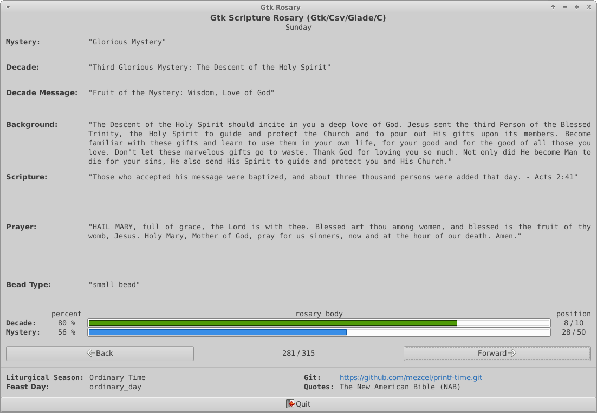

<!-- pandoc formatting
title: 'printf-time'
subtitle: 'A scripture Rosary written in C for Debian Linux and Win10 VS'
author: 'Mezcel'
date: 'Jan 1, 2019'
description: 'Scripture rosary using English and Latin Bible text.'
lang: en-US
-->

# printf-time

> Version: ```v0.4.5.?``` (WIP)

Added a feature which decorates the BASH terminal with seasonal scripture readings.

```diff
+ If BASH is installed, the ~/.bashrc will launch ttyBashrc.
+ ttyBashrc will display the following upon it's initial launch
+   * Current liturgical calendar season
+   * Display a seasonal quote of the day from the rosary scripture database.
```

## About:

A **( Latin / English )** scripture **Rosary** written in C/GCC for the GTK and the TTY. It uses both a CSV and a JSON Database. The CSV contains NAB quotes in English and the JSON contains Vulgate quotes in Latin.

## UI Options:

| CLI Version | GTK3 Version |
| :---: | :---: |
| Outdated LIVE DEMO (v0.3.5) i686 Debian | Outdated Screenshot (v0.2) i686 Debian |
| [](https://asciinema.org/a/278468) |  |

---

# Compile C

## 1. Compile on Debian or WLS ( Primary OS )

```Makefile```

```sh
## Clean previously complied binary builds and undo changes made to bashrc by ttyBasrc

make clean

## Build and compile everything
## The following programs will be built: ttyRosary and gtkRosary

make

## or build individual programs

make ttyRosary
make gtkRosary
```

### 1.1 Run

```sh
## TTY App

./ttyRosary         ## NAB English, using a CSV database
./ttyRosary -v      ## Vulgate Latin, using a JSON database

## GTK App

./gtkRosary         ## NAB English
./gtkRosary -v      ## Vulgate Latin
```

### 1.1.1 Holiday Themed Bashrc (WIP)

* Bonus feature for the Bash CLI UI.
* During liturgical calendar seasons, the 1st lines of a Bash terminal instance will display a bible quote pertaining to that season.
    * *Bash is the default terminal emulator on Debian Linux.*

```bash
## Compile a binary which is set to launch whenever GNU Bash is launched.
## Holiday themed messages will be displayed on the terminal, at Bash startup

make ttyBashrc
```

### 1.2 Debian Dependencies

> If you get a compile error from the make build: ```#include <json-c/json.h>```, then use ```make debian``` to install potentially missing dependencies.
> It is assumed that Xorg and GTK are installed on the base system.

```sh
## Get dependencies for Debian 9 or newer using the Makefile
make debian

## debian libjson-c dependencies
sudo apt install autotools-dev debhelper dh-autoreconf dh-exec

## debian libjson-c
sudo apt install libjson-c-dev libjson-c-doc libjson-c3

## man page (Manually install groff and pandoc. Not included with Makefile)
sudo apt install groff pandoc
```

## 2. Compile on Win10 ( Secondary OS )

### 2.1 Visual Studio's Developer Powershell / Command Prompt

* [Configure VS Code for Microsoft C++](https://code.visualstudio.com/docs/cpp/config-msvc)
* [Visual Studio](https://visualstudio.microsoft.com/downloads/#other)

```ps1
## clean previous builds
Remove-Item *.obj
Remove-Item *.exe

## Compile and build with Visual Studio's Developer Powershell/Command Prompt
cl /c sources\my_calendar.c
cl /c sources\my_csv_structs.c
cl /c sources\my_tty_ui.c
cl mainTTY.c my_calendar.obj my_csv_structs.obj my_tty_ui.obj /o "ttyRosary.exe"

## run
.\ttyRosary.exe
```

### 2.2 Homebrew Makefile scripts

I made the following to scripts to automate the compile and build preocess.

* ```Makefile_win.bat``` and ```Makefile_win.ps1```
* Added [Nmake](https://docs.microsoft.com/en-us/cpp/build/reference/nmake-reference?view=vs-2019) options within a  GNU [Makefile](https://en.wikipedia.org/wiki/Makefile)

```Makefile``` or ```nmake```

```bat
:: Win10's nmake

:: clean
nmake nclean

:: build
nmake build
```

Developer Powershell for VS 2019

```ps1
.\Makefile_win.ps1 clean
.\Makefile_win.ps1 build
.\Makefile_win.ps1 run
```

Developer Command Prompt for VS 2019

```bat
.\Makefile_win.bat clean
.\Makefile_win.bat build
.\Makefile_win.bat run
```

VS Code Editor:

* I occasionally do Win10 C compiling in VS Code. (I prefer **VS2019** over VSCode as a Win10 C/C++ editor)
* Launch ```code .``` from within ```Developer Powershell for VS 2019```

---

## 3.0 Development Evolution:

### 3.1 Other Version Platforms

This is the 5th program language version in my Rosary App series.

#### Previous versions:

| .NET/Windows OS | NodeJS/Electron | BASH/GNU | Python (Win/Linux) |
| --- | --- | --- | --- |
|[git](https://github.com/mezcel/rosary.net)|[git](https://github.com/mezcel/electron-container)|[git](https://github.com/mezcel/jq-tput-terminal)|[git](https://github.com/mezcel/python-curses)|
| Windows | cross platform with Electron | Linux | cross platform with Python|
| MySql Database | JSON Database | JSON Database | JSON Database |
| English and Latin | English and Latin | English and Latin | English only|
|a WinForm version and a WPF/WCF version|an Electron and Heroku version|shell on Archlinux, Debian, Tiny Core, Alpine| a curses app |
| [project wiki](https://mezcel.wixsite.com/rosary) : ```developed on Windows 9``` | Uses Jquery Mobile and/or Electron. Has variable color themes, liturgical calendar and feast day calculations. | It has variable tty colors, liturgical calendar calculations, windows sizing. Curses bases | just a TTY/Cli App|
| no audio | audio theme song | audio soundtrack (latin prayer chant) | no audio |
| lan | internet scraped mass readings | internet scraped mass readings | no interactive networking features |
| multi user / multi session / group synchronization | multi user / multi session / group synchronization | single user | single user |

### 3.2 Misc. Development Background

#### Debian Runtime Environment

* Linux, [MinGW](http://www.mingw.org/) or Win10 Powershell with Visual Studio C++
* Command line interface (CLI) / Shell Terminal
* Xorg (Debian linux) or Xlaunch (Win10/WLS)

#### Debian Developer Environment (debug/mod)

* [MinGW](http://www.mingw.org/) or Linux (x86 or x64)
    * this app was developed on Debian WLS and tested on a real Linux
* GCC v6+
* [Glade](https://glade.gnome.org/) (a gui designing tool)
* any text editor (I use Geany for everything on Linux)
    * Geany macros for quick and easy gtk3 development
    * compile:  gcc -Wall -c "%f" `pkg-config --cflags --libs gtk+-3.0` -export-dynamic
    * build:    gcc -Wall -o "%e" "%f" `pkg-config --cflags --libs gtk+-3.0` -export-dynamic

### 3.3 Win10 MinGW ( not tested recently )

```sh
## Compile in Debian and make it usable on a Win10

sudo apt install mingw-w64
i686-w64-mingw32-gcc "main.c" -o "my-executable-file.exe"

## Compile in Win10 with MinGW installed

gcc "main.c" -o "my-executable-file.exe "
```
