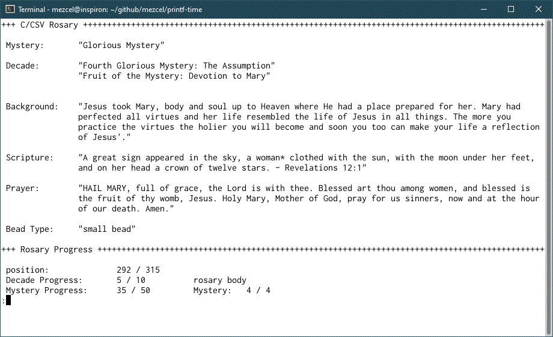

# printf-time

	this repo was initially a feast day calulator, but then it evolved into a rosary app.

dev branch: ```v0.3.5```

### About:

A scripture rosary witten in C/GCC for the GTK and the TTY. It uses both a CSV and a JSON Database. The CSV contains NAB quotes in English and the JSON contains Vulgate quotes in Latin.

### GUI Options:

CSV Database:

| English CLI Version | English GTK3 Version |
| --- | --- |
| Navigate using Vi kebindings or gamer keys. | The user navigates with push-button widget objects. |
| outdated screenshot was taken on a Debian WLS | outdated screenshot was taken on a i686 Debian |
|  |  |
| [new-ish animated cli demo](https://asciinema.org/a/278462) ```from v0.3.5``` | - |

JSON Database:

| Latin CLI Version |
| --- |
| Same UI as the English version, but it uses the json-c library |

---

### Compile on Debian

```sh
## Makefile flags ##

# build everything
make

# build one of the TTY versions
make ttyRosary

# build one of the GTK versions
make gtkRosary

# reset/clear previous object builds
make clean
```

### Run
```sh
## TTY App

./ttyRosary		## NAB English
./ttyRosary -v	## Vulgate Latin

## GTK App

./gtkRosary		## NAB English
./gtkRosary -v	## Vulgate Latin
```

### Dependencies

If you get a compile error from the make build: ```#include <json-c/json.h>```, then use ```make debian``` to install potentially missing dependencies. This applies only to compilation on Debian based distros.

```sh
## Get dependencies for Debian 9 or newer
# used for initial 1st-time setup
make debian

## debian libjson-c dependencies
sudo apt install autotools-dev debhelper dh-autoreconf dh-exec

## debian stretch (libs): 0.12.1-1.1
sudo apt install libjson-c-dev libjson-c-doc libjson-c3
```

---

### Dev. Evolution:

This is the 5th program language version in my Rosary App series.

Previous versions were:

| .NET/Windows OS | NodeJS/Electron | BASH/GNU | Python (Win/Linux) |
| --- | --- | --- | --- |
|[git](https://github.com/mezcel/rosary.net)|[git](https://github.com/mezcel/electron-container)|[git](https://github.com/mezcel/jq-tput-terminal)|[git](https://github.com/mezcel/python-curses)|
| Windows | cross platform with a web browser | Linux | cross platform with python|
| MySql Database | JSON Database | JSON Database | JSON Database |
| English and Latin | English and Latin | English and Latin | English only|
|a WinForm version and a WPF/WCF version|an Electron and Heroku version|shell on Arch & Debian| a curses app |
| [project design page](https://mezcel.wixsite.com/rosary) ```developed on Windows 9``` | Uses Jquery Mobile and/or Electron. Has variable color themes, liturgical calendar and feast day calculations. | It has variable tty colors, liturgical calendar calculations, windows sizing. Curses bases | just a TTY/Cli App|
| no audio | audio theme song | audio (curated event triggered Libre soundtrack) | no audio |
| lan | internet scraped mass readings | internet scraped mass readings | no interactive networking features |
| multi user / multi session / group synchronization | multi user / multi session / group synchronization | single user | single user |

---

### Project Status:

#### v0.3.5.? (current development)

* Tested on Linux and WLS, I have not yet tested it on a Mac or MinGW
* The Makefile now includes isolated build options
* Progressbar is now more visually informative in the TTY version
* Need to go back and clean up the feast day calculator

##### Runtime Environment

* [MinGW](http://www.mingw.org/) or Linux
* Command line interface (CLI) / Shell Terminal
* Xorg (Debian linux) or Xlaunch (Win10/WLS)

##### Developer Environment (debug/mod)

* [MinGW](http://www.mingw.org/) or Linux (x86 or x64)
	* this app was developed on Debian WLS and tested on a real Linux
* GCC v6+
* Glade (a gui drawing tool)
* any text editor (I use Geany for everything)
	* Geany macros for quick and easy gtk3 development
	* compile:	gcc -Wall -c "%f" `pkg-config --cflags --libs gtk+-3.0` -export-dynamic
	* build:	gcc -Wall -o "%e" "%f" `pkg-config --cflags --libs gtk+-3.0` -export-dynamic

---

Win10

```sh
## Compile in Debian and make it usable on a Win10
sudo apt install mingw-w64
i686-w64-mingw32-gcc "main.c" -o "my-executable-file.exe"

## Compile in Win10 with MinGW installed
gcc "main.c" -o "my-executable-file.exe "
```

---

## General Demo

[](https://asciinema.org/a/278462)
