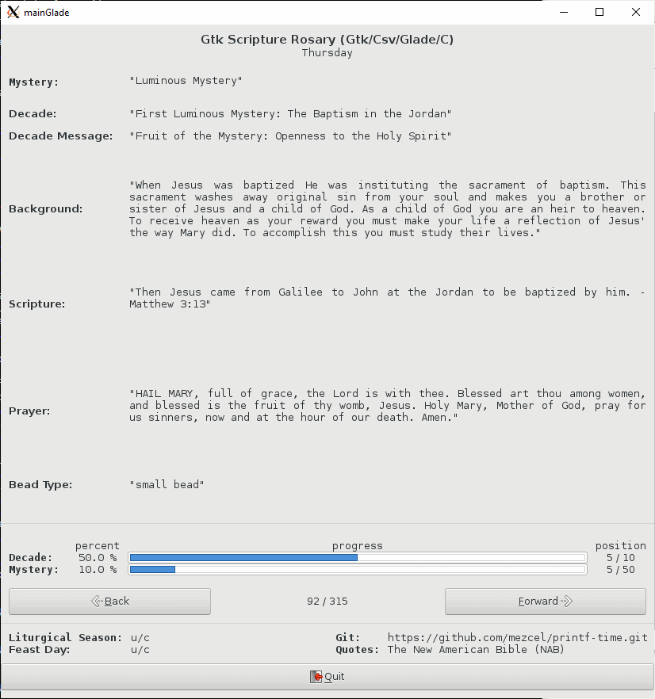

## printf-time ./Rosary/gtk-wip/

#### Gtk version (Under Construction)

I resorted to using the Glade app to design my GUI layout. Glade is a tool for creating Gtk GUIs. Glade generates an XML file, ```*.glade```. Gtk's ```libgtk-3-dev``` will translate the XML file into a GUI layout.

* A point and click UI maker for ```libgtk-3-dev```
* It prepares callback function prototypes for use in ```main()```

#### Todo:

* clean up script
* start integrating calendar feast day flags

---

#### Instructions:

```bash
## Install the Gtk dependency
sudo apt install libgtk-3-dev

## Install the Glade dependency if you want to modify the .glade file (optional)
sudo apt install glade

## Compile with the Glade generated XML file
gcc -o mainGlade mainGlade.c -Wall `pkg-config --cflags --libs gtk+-3.0` -export-dynamic

## RUN:
./mainGtk
```
---

#### Screenshot (stop point)

This is the general layout I am going for.


